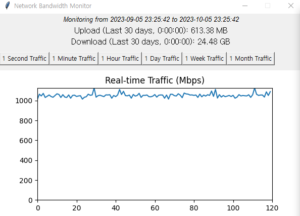

# Network Bandwidth Monitor

This tool provides real-time monitoring of your network's bandwidth usage with a graphical representation. Designed with simplicity in mind, it aggregates data across all network interfaces and displays both uploads and downloads in Mbps.

  <!-- You can add a screenshot of your tool here -->

## Features

- **Real-time Monitoring**: Continuously tracks and updates network usage every 0.5 seconds.
- **Graphical Display**: Presents the bandwidth usage on a graph for a clear overview.
- **Flexible Time Frames**: Allows users to check bandwidth usage for specific time intervals like 1 second, 1 minute, 1 hour, and so on.
- **Database Storage**: Stores traffic data in a lightweight SQLite database, ensuring persistence even after shutting down.

## Installation

### Prerequisites

Make sure you have Python installed on your machine.

### Steps

1. Clone this repository:
```bash
git clone https://github.com/MovieHolic-Plex/simple_network_traffic_monitor_with_graph

cd simple_network_traffic_monitor_with_graph

pip install -r requirements.txt


```

### Usage
```

Run the script using the following command:

python main.py
```

# Once the program is running:

* You'll initially see the bandwidth usage for the past day.
* Use the buttons provided to select different time intervals.
* The graph updates in real-time, showcasing the current traffic rate in Mbps.
* Below the graph, you'll find the total upload and download data for the selected time frame.


# Libraries Used
* Tkinter: For the graphical user interface.
* psutil: To gather network statistics.
* matplotlib: To create the real-time graph.
* numpy: For numerical operations and data manipulation.
* sqlite3: For data storage and retrieval.

# License
This project is licensed under the MIT License. Check the LICENSE file for more details.

